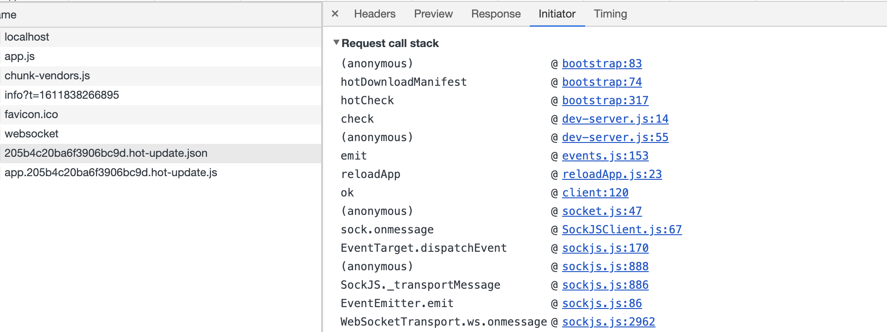
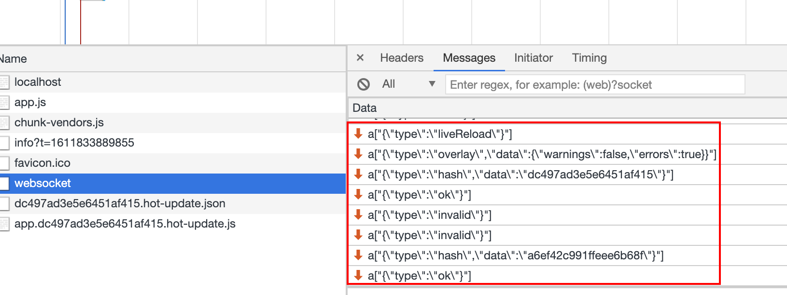

# webpack热更新

当使用vue/cli快速创建一个vue工程的时候，运行`npm run serve` 开发时，每当我们修改内容的时候，页面会自动更新内容，无需手动去刷新，大大提高了开发体验。接下来我们来分析下这个流程

```json
    "script": {
        "serve": "vue-cli-service --serve"
    }
```

## vue-cli-service serve

执行`npm run serve`前，我们在`node_modules/webpack/lib/webpack.js`, 打印一下入口`options.entry`
发现vue/cli会在入口加入两个额外的文件, 分别是服务端的代码和客户端的代码, 而且会添加webpack内置的热更新插件 `HotModuleReplacementPlugin`
去查看`@vue/cli-service/lib/commands/serve.js`, 无非就是修改了入口增加了上面说的两个文件，增加了hrm插件，启动了一个webpack的编译
还有实例了一个WebpackDevServer，调用了listen方法，开启了一个express服务器用来访问我们的index.html啥的

```js
// 打印入口
{ app:
   [ 
    // 服务端代码
    '/Users/pengdahan412/DEMO/vue-common-form/node_modules/webpack-dev-server/client/index.js',
    // 客户端代码
     '/Users/pengdahan412/DEMO/vue-common-form/node_modules/webpack/hot/dev-server.js',
     // 主入口文件
     './src/main.js' 
   ]
}


```
## 热更新客户端和服务端文件

- 客户端文件`webpack/hot/dev-server.js`
- 服务端文件`webpack-dev-server/client/index.js`
- `HotModuleReplacementPlugin` 插件

**这里是一次完整热更新的调用栈, reloadApp以下是跟服务端相关，上面则是浏览器客户端相关**


### 服务端
文件 `webpack-dev-server/bin/webpack-dev-server.js`中，这里拿到提供的webpack实例作为参数会实例一个Server对象

```js
function startDevServer(config, options) {
  const log = createLogger(options);

  let compiler;

  try {
    compiler = webpack(config);
  } catch (err) {
    if (err instanceof webpack.WebpackOptionsValidationError) {
      log.error(colors.error(options.stats.colors, err.message));
      // eslint-disable-next-line no-process-exit
      process.exit(1);
    }

    throw err;
  }

    server = new Server(compiler, options, log);
    serverData.server = server;
    ...
    ... 省略
}
```
Server主要会完成以下工作
1. 给compiler增加额外的hooks，比如done钩子，每次修改文件重新编译完成进入到这个钩子会调用server上的_sendStats方法,下发hash、和ok消息
```js
    const addHooks = (compiler) => {
      const { compile, invalid, done } = compiler.hooks;

      compile.tap('webpack-dev-server', invalidPlugin); // 注册编译回调
      invalid.tap('webpack-dev-server', invalidPlugin); 
      done.tap('webpack-dev-server', (stats) => {
        
        this._sendStats(this.sockets, this.getStats(stats));
        this._stats = stats; // 获取当前compilation
      });
    };

  _sendStats(sockets, stats, force) {
    ...
    ...

    this.sockWrite(sockets, 'hash', stats.hash);
    this.sockWrite(sockets, 'ok');
  }
```
2. 创建express实例app，设置app的一些属性，添加中间价`webpack-dev-middleware`<br>
`webpack-dev-middleware`主要的作用就是修改compiler.outputFileSystem为`memory-fs`，这个包主要的作用就是将打包的文件写入到内存，所以serve的时候看不到dist文件夹
好处就是比写入读取到硬盘速度快很多，webpack-dev-middleware还对请求做了一些拦截，负责返回我们想要访问的文件，比如dist/index.html


### webpack-dev-server/client/index.js

这个文件主要在和上面的express实例子建立socket连接，接受到下发的信息后，执行指定的方法,
如下图，一次的热更新会下发很多信息，比如type为hash、ok等，比如hash就是设置新的hash，
ok会执行reloadApp方法, 参考文件`node_modules/webpack-dev-server/client/index.js`



什么时候会下发scoket信息呢？回到上面的_sendStats方法，文件被修改后就会done钩子注册的回调，会执行_sendStats，下发hash和ok信息

```js
// webpack-dev-server/client/index.js
var socket = require('./socket');
...
var reloadApp = require('./utils/reloadApp');

var createSocketUrl = require('./utils/createSocketUrl');

var status = {
  isUnloading: false,
  currentHash: ''
};
var options = {
  hot: false,
  hotReload: true,
    ...
};
var socketUrl = createSocketUrl(__resourceQuery);


var onSocketMessage = {
  hot: function hot() {
    options.hot = true;
    log.info('[WDS] Hot Module Replacement enabled.');
  },

  invalid: function invalid() {
    sendMessage('Invalid');
  },
  hash: function hash(_hash) {
    status.currentHash = _hash;
  },
  ok: function ok() {
    sendMessage('Ok');

    reloadApp(options, status);
  },
    ...
};
socket(socketUrl, onSocketMessage);
```
hash事件就是修改当前的currentHash，ok事件会reloadApp，
```js
// /utils/reloadApp'

var _require = require('./log'),
    log = _require.log;

function reloadApp(_ref, _ref2) {
  var hotReload = _ref.hotReload,
      hot = _ref.hot,
      liveReload = _ref.liveReload;
  var isUnloading = _ref2.isUnloading,
      currentHash = _ref2.currentHash;

  if (hot) {
    log.info('[WDS] App hot update...');

    var hotEmitter = require('webpack/hot/emitter');

    hotEmitter.emit('webpackHotUpdate', currentHash);

  }

}

```
reloadApp就是去emit了webpackHotUpdate事件，而这个事件是在客户端注册的，在文件webpack/hot/dev-server.js

#### webpack/hot/dev-server.js

webpackHotUpdate在这个文件注册，里面就是执行check方法，会调用module.hot.check

```js
// webpack/hot/dev-server.js
if (module.hot) {
	var lastHash;
	var upToDate = function upToDate() {
		return lastHash.indexOf(__webpack_hash__) >= 0;
	};
	var log = require("./log");
	var check = function check() {
		module.hot
			.check(true)
			.then(function(updatedModules) {
				if (!upToDate()) {
					check();
				}

				require("./log-apply-result")(updatedModules, updatedModules);

				if (upToDate()) {
					log("info", "[HMR] App is up to date.");
				}
			})
	};
	var hotEmitter = require("./emitter");
	hotEmitter.on("webpackHotUpdate", function(currentHash) {
		lastHash = currentHash;
		check();

	});
}

```
module在webpack的概念不清楚的话，这里简单说下，下面add.js和app.js都是一个module
```js
// add.js
function add(a, b) { return a + b };

// app.js
import add from './add';
add(1,2)
```
moduled.hot又是在哪里定义的呢，这里就要说到webpack的jsonTemplate, webpack打包后的文件都开头都是一些定义好的bootstrap方法，比如__webpack_require__方法，
而HotModuleReplacementPlugin插件也会定义热更新的模板，

### HotModuleReplacementPlugin
HotModuleReplacementPlugin主要做了以下事情
- 修改bootstrap为热更新的模板
  - `webpack/lib/web/JsonpMainTemplate.runtime`
  - `webpack/lib/HotModuleReplacement.runtime `
  - `webpack/lib/HotModuleReplacementPlugin`

- 每次修改编译完成后生成两个文件
 - `xxx..hot-update.json` (该文件包含所有要更新模块的hash值和chunk名)
 - `xxx.hot-update.js` （要替换掉的js）

 **bootstrap**
 ```js

/******/ 	function __webpack_require__(moduleId) {
/******/
/******/ 		// Check if module is in cache
/******/ 		if(installedModules[moduleId]) {
/******/ 			return installedModules[moduleId].exports;
/******/ 		}
/******/ 		// Create a new module (and put it into the cache)
/******/ 		var module = installedModules[moduleId] = {
/******/ 			i: moduleId,
/******/ 			l: false,
/******/ 			exports: {},
/******/ 			hot: hotCreateModule(moduleId), 在这里定义hot
/******/ 			parents: (hotCurrentParentsTemp = hotCurrentParents, hotCurrentParents = [], hotCurrentParentsTemp),
/******/ 			children: []
/******/ 		};
/******/
/******/ 		// Execute the module function
/******/ 		modules[moduleId].call(module.exports, module, module.exports, hotCreateRequire(moduleId));
/******/
/******/ 		// Flag the module as loaded
/******/ 		module.l = true;
/******/
/******/ 		// Return the exports of the module
/******/ 		return module.exports;
/******/ 	}

                function hotCreateModule (moduleId) {
                    return {
                        hot: hotcheck
                    }
                }
                var chunkId = 'app'
                function hotcheck () {
                    return hotDownloadManifest().then(update => {
                        hotEnsureUpdateChunk(chunkId);
                    })
                }
                // 这里就会去请求HotModuleReplacementPlugin生成的json文件
                function hotDownloadManifest() {
                    return new Promise(function(resolve){
                        let request = new XMLHttpRequest()
                        let requestPath = '/'+hotCurrentHash+".hot-update.json"
                        request.open('GET', requestPath, true)
                        request.onreadystatechange = function(){
                            if(request.readyState === 4){
                                let update = JSON.parse(request.responseText)
                                resolve(update)
                            }
                        }
                        request.send()
                    })
                }

                function hotEnsureUpdateChunk(chunkId) {
                    hotDownloadUpdateChunk(chunkId);
                }

                // 去请求xxx.hot-update.js, 我们需要替换的模块，使用异步script方法下载
/******/ 	function hotDownloadUpdateChunk(chunkId) {
/******/ 		var script = document.createElement("script");
/******/ 		script.charset = "utf-8";
/******/ 		script.src = __webpack_require__.p + "" + chunkId + "." + hotCurrentHash + ".hot-update.js";
/******/ 		if (null) script.crossOrigin = null;
/******/ 		document.head.appendChild(script);
/******/ 	}

            // .hot-update.js 就是一个被webpackHotUpdate("app",{})模块调用
            // 为了拉取到的代码直接执行，客户端需要定义一个 webpackHotUpdate 函数来处理
            // webpackHotUpdate函数HotModuleReplacementPlugin已经在模版定义

/******/ 	var parentHotUpdateCallback = window["webpackHotUpdate"];
/******/ 	window["webpackHotUpdate"] = // eslint-disable-next-line no-unused-vars
/******/ 	function webpackHotUpdateCallback(chunkId, moreModule s) {
/******/ 		hotAddUpdateChunk(chunkId, moreModules);  // 这个函数可以自己去看看，比较复杂
/******/ 		if (parentHotUpdateCallback) parentHotUpdateCallback(chunkId, moreModules);
/******/ 	} ;

            //  webpackHotUpdate方法是在window上的，如果你改了成了自己的方法，就会覆盖HotModuleReplacementPlugin定义好的

 ```

## 流程梳理
服务端：

- 启动webpack-dev-server服务器
- 创建webpack实例
- 创建Server服务器
- 添加webpack的done事件回调 编译完成向客户端发送消息（hash和描述文件oldhash.js和oldhash.json）
- 创建express应用app
- 设置文件系统为内存文件系统
- 添加webpack-dev-middleware中间件 负责返回生成的文件
- 创建http服务 启动
- 使用socket 实现浏览器和服务器的通信（这里先发送一次hash，将socket存入到第四步，初次编译完第四步中的socket是空，不会触发hash下发）

客户端：
1.webpack-dev-server/client-src下文件监听hash，保存此hash值
2.客户端收到ok消息执行reload更新
- 在reload中进行判断，如果支持热更新执行webpackHotUpdate，不支持的话直接刷新页面
- 在webpack/hot/dev-server.js监听webpackHotUpdate 然后执行 check() 方法进行检测
- 在check方法里面调用module.hot.check
- 通过调用 JsonpMainTemplate.runtime的hotDownloadmainfest方法，向server端发送ajax请求，服务端返回一个Mainfest文件，该文件包含所有要更新模块的hash值和chunk名
- 调用 JsonpMainTemplate.runtime 的 hotDownloadUpdateChunk方法通过jsonp请求获取到最新的模块代码
- 补丁js取回后调用 JsonpMainTemplate.runtime 的 webpackHotUpdate方法，里面会调用hotAddUpdateChunk方法，用心的模块替换掉旧的模块
- 调用HotMoudleReplacement.runtime.js 的 hotAddUpdateChunk方法动态更新模块代码
- 调用 hotApply 方法热更新

[参考 webpack热更新原理](https://www.runoob.com)

只要在浏览器打个断点其实是很容易理解热更新的流程的， 核心的函数并不多