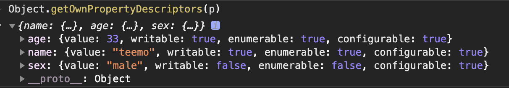
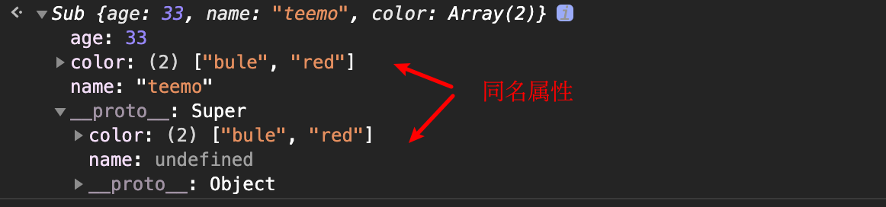
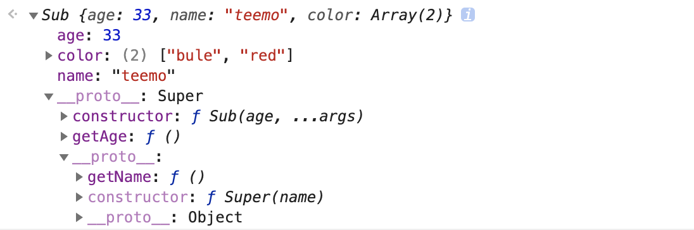

# javascript 基础

## 什么是javascript？
`JavaScript` 是一门用来与网页交互的脚本语言，包含以下三个组成部分
- `ECMAScript` 就是我们常常说的 JS
- 文档对象模型(DOM):提供与网页内容交互的方法和接口
- 浏览器对象模型(BOM):提供与浏览器交互的方法和接口，也叫做WebApi

## 基本数据类型
- String 字符串
- Number 数字
- Boolean 布尔值
- null
- undefined
- Symbol

### String
```js
let str = 'bigham';
str[1] = 'B';
console.log(str); // bigham
```
可以通过字面量快速创建一个字符串变量，字符串是不可变的，一旦被创建就无法被改变，上面试图改变字符串的第一个字符，但是是无效的。
如果要想修改某个变量中的字符串值，必须先销毁原来的字符串，然后将包含新值的另一个字符串保存到该变量，如 下所示:
```js
let str = 'bigham';
str = 'hello ' + str;
console.log(str); // 'hello bigham';
```
`String`函数可以把任何类型的值转为对应的字符串形式，`String(xxx)` 的意思就是调用`xxx.toString()` 并返回值
```js
String(1234); // 等价于 (1234).toString()，返回'1234'
String({}); // 等价于 ({}).toString()，返回'[object Object]'
String([1,2]) // 等价于 ([1,2]).toString()，返回'1,2'
String(Function) // 等价于 Function.toString()，返回'function Function() { [native code] }'
```

### Number
如果我们想声明一个变量的值是3，最直接的方法就像下面
```js
let num = 3;
// 当然也可以使用parseInt来转换表示一个数字
let num = parseInt(3); // parseInt的第二个参数默认使用10进值
```
整数也可以使用八进制，八进制指的是，第一个数字必须是零(0)，然后是相应的八进制数字(数值 0~7)
```js
let octalNum1 = 070; // 八进制的56
```
但是最好不要用八进制表示一个整数，严格模式下 `scrict mode`就禁止使用0开头表示八进制，很多eslint使用的规则默认禁止使用八进制
#### 数字精度问题
一个很经典的问题， `0.1 + 0.2` 等于多少
```js
if (0.1 + 0.2) { // 永远都为false 0.1+0.2=0.300 000 000 000 000 04
    // do something
}
```
这里检测两个数值之和是否等于 0.3。如果两个数值分别是 0.05 和 0.25，或者 0.15 和 0.15，那没问题，因此在计算小数的时候，为了避免精度偏差，可以转为整数，然后除于倍数
```js
(0.1 * 10 + 0.2 * 10) / 10; // 0.3
```
#### NaN & Infinity
`NaN` 和 `Infinity`, 都是`number`类型, 需要注意的是，NaN 和任何number类型做运算结果都是NaN，且NaN不等于NaN
```js
NaN + 1; // NaN
NaN / 2; // Nan
NaN == NaN; // false
```
### Boolean
boolean指的是`true`和`false`,  js中任何值都可以通过Boolean函数转为布尔值，其中只需要那些会会被转为false即可，剩下的都是true
```js
// 布尔为false的所有场景
Boolean(NaN);
Boolean(0);
Boolean(-0);
Boolean(false);
Boolean('');
Boolean(undefined);
Boolean(null);
// 反之都是true
...
```
### undefined
`javascript` 中会得到值为 `undefined` 有下面三种情况
- 主动把 `undefined` 赋值给变量
- 函数没有返回值，那么函数执行得到的值为 `undefined`
- 声明一个变量，但是没有给初始值
```js
let a = undefined;
let b = (function () {})();
let c;
```
需要注意的是，`undefined` 是window的一个属性，它是只读的，不能被重写
```js
'undefined' in window; // true;
window.undefined; // undefined
window.undefined = 123; // 重写无效，值还是undefined
```
### null
除非手动把 `null` 赋值给一个变量，否则任何情况下都不会出现值为 `null`的情况。`null`最大的作用可以脱离一个变量的引用关系，
可以主动让`javascript` 垃圾回收机制回收这个值的引用
```js
let a = {name: 'bigham'};
a = null;// 会切断变量a与其之前引用值{name: 'bigham'}之间的关系，使{name: 'bigham'}能被回收
```
::: tip
`typeof null === 'object'`, 因此使用`typeof`操作符判断是否`object`类型时需要注意`null`的情况，比较安全判断是`object`类型
`xxx && typeof xxx === 'object'`(非空)
:::

### Symbol
`symbol` 类型是`es6`推出的一种基础类型, 旨在有一种永远不会重复的值，symbol返回的值和任何值都不会相等
```js
Symbol(1) != Symbol(1); // true
```
## 作用域和函数参数
### 作用域
全局上下文是顶层上下文，在浏览器中，全局上下文指的是window所在的那层，而window对象是当前上下文context，通过var定义的全局变量和函数都会成为window上面的属性，而let和const不会。
每个函数被执行的时候都会创建变量对象的一个作用域链(scope chain)，这个作用域链决定了各级上下文中的代码在访问变量和函数时的顺序，用代码来解析下
```js
var age = 20;
var size = 'large';
function changeInfo() {
    let age = 30;
    console.log(age); // 30, 因为在changeInfo函数的上下文中能找到age
    console.log(size); 
    // 'large', 因为在changeInfo函数的上下文中没找到size，
    // 只能继续往上层上下文查找，直到全局上下文window所在的那层
    // console.log(innerAge)
    // innerAge is not define, 报错，因为innerAge变量只存在inner函数所在的上下文，不能向下访问
    function inner() {
        let innerAge = 20;
        console.log(age); 
        // 100, 因为在inner函数的上下文中找不到到age，所以只能向上层上下文changeInfo函数查找
        // 然后在找到了changeInfo中定义的age，一旦找到了就不会继续向上找，所以不是window上的age
        console.log(innerAge)
        // 20, 因为在当前inner函数的上下文就找了innerAge
        console.log(size);
        // large, 因为在inner函数的上下文中找不到到age，所以只能向上层上下文changeInfo函数查找
        // 然后在changeInfo函数上下文也没有找到，只能继续向上层作用域查找，最后在window上找到size变量
    }
    
    inner();
}
changeInfo();
console.log(color); // 'blue' 因为我们在全局上下午上，所以只能访问最近的color
console.log(innerAge); // innerAge is not define, 报错，因为innerAge变量只存在inner函数所在的上下文，不能向下访问
```
我们用图来表示下作用域链, 涉及了三个上下文

```js
window
|____age
|____size
|____changeInfo()
        |____age
        |____inner()
                |____innerAge
```
- 全局上下文window上有个age、size变量和changeInfo函数。
- changeInfo()的局部上下文中，有age和inner函数，在changeInfo中可以访问到age、inner和size，如果要访问window上age需要通过window.age访问，因为就近原则changeInfo()函数的上下文就能访问到自己的age，就不会继续往上找。
- inner()函数局部上下文中能访问到innerAge、和其他所有上下文中的变量，因为它们都是父上下文关系，会传递给inner()。
::: danger
子上下文能访问父上下文中的变量，但是父上下文不能访问子上下文中的变量，因为它们是局部的，只能向上不能向下，所以`console.log(innerAge)会报错`
:::

### 函数的入参
所有函数的参数都是按值传递的，不是按照引用传递的，意思是函数外面的值会被复制到函数声明的形参中，函数的入参是值的复制。
```js
// 基本类型的实参
const n = 10;
function tens (num) {
    num *= 10;
    return num
}
tens(n);
console.log(n);
// 10, 没有变化，说明不是按照引用传递的的，如果是按照引用传递那么变量n应该变成100，但是并没有
// 在tens函数内部，参数 num的值*10，但这不会影响函数外部的原始变量 n。tens函数参数 num 和变量 n互不干扰

// 引用类型的实参
const info = {
    name: 'bigham',
}
function changeName (obj) {
    obj.name = 'qiuqiu';
    obj = null;
}
changeName(info); 
console.log(info); 
// {name: 'qiuqiu'}, 因为把info复制给obj, obj修改了name, info也会也会被修改, 最后obj变成了null, 
// 但是info还是{name: 'qiuqiu'}, 如果是按照引用那么info应该变成了null
// changeName函数可以理解成这样, obj = info，这里就是值的复制
function changeName() {
    let obj;
    obj = info;
    obj.name = 'qiuqiu';
    obj = null;
}
```
上面的 `tens` 和 `changeName`运行起来没有报错，我们知道通过`const` 声明的变量是不能被重写的，如果是按照引用传递的明显就说不通了

## 原始值包装类型
```js
const str = 'qiuqiu';
const str2 = str.slice(3); // qiu
```
我们知道原始值比如字符串、数字、布尔值不是对象，理论上应该是没有其他属性的，但是上面的例子`str`变量却有`slice`方法,
这是因为每当用到某个原始值的方法或属性时，js引擎都会创建一个相应原始包装类型的对象，从而暴露出操作原始值的各种方法。具体来说，当第二行访问`str`的时候，
是以只读模式访问的，以只读模式访问的时候，js都会做以下三个工作：
- 创建一个String类型的实例
- 调用实例上面特定的方法
- 销毁实例（垃圾回收）

```js
// 当上面第二行读取str的值时, 可以把上面理解为如下
let _temp_str = new String('qiuqiu'); // 创建一个临时的包装对象，对象上有String实例的所有方法
const str2 = _temp_str.slice(3); // 调用实例slice方法并返回
_temp_str = null; // 销毁实例

```
### 为什么无法给原始值添加属性？
来看下下面的代码,试图给`str`添加新属性和重写`slice`，但是都没有生效
```js
let qiuqiu = 'qiuqiu';
qiuqiu.age = 25;
console.log(qiuqiu.age); // undefined

qiuqiu.silce = 1234;
cosnole.log(qiuqiu.slice); // ƒ slice() { [native code] }, 并不是1234
```
为什么上面的代码赋值语和重写都没有生效呢？ 用上面说的当访问原始值属性的时候，js会做上面说的三件事，上面的代码可以解析成如下：
```js
let qiuqiu = 'qiuqiu';
// qiuqiu.age = 25; 可以视为下面三行代码
let _temp = new String('qiuqiu');
_temp.age = 25;
_temp = null;
// console.log(qiuqiu.age) 等于下面代码；
let _temp2 = new String('qiuqiu');
console.log(_temp2.age); // 因为String.prototype没有age这个属性所以是undefined
_temp2 = null;


// qiuqiu.slice = 1234; 等价于
let _temp3 = new String('qiuqiu');
_temp3.slice = 1234;
_temp3 = null;
// console.log(qiuqiu.slice); 等价于
let _temp4 = new String('qiuqiu');
console.log(_temp4.slice); // 因为String.prototype上有slice方法，所以输出ƒ slice() { [native code] }
_temp4 = null; // 立刻销毁
```
从上面可以看出，自动创建的包装类型临时对象的生命周期很特殊，只存在于访问它的那行代码执行期间，然后立刻销毁，所以我们不能在运行时给原始值添加属性和方法。
如果想要添加额外的属性或重写属性和方法，应该在`String.prototype`上修改。同理`Boolean`、`Number` 和 `String`类型的原始值都是不能在运行时给原始值添加属性和方法。

## 原型链
:::tip 定义
当访问一个对象的某个属性时，会先在这个对象本身属性上查找，如果没有找到，则会去它的__proto__隐式原型上查找，即它的构造函数的prototype，如果还没有找到就会再在构造函数的prototype的__proto__中查找，这样一层一层向上查找就会形成一个链式结构，我们称为原型链
:::


上面的原型链图片很好的解析了`__proto__` 、 `prototype`和`constructor`的关系, 需要注意的是`function`也是一个对象，可以通过`new Function()`方式创建(不建议这样做)，所以也有
`__proto__`属性。当访问引用类型的属性时，会在原型链上找，并遵循就近原则。
:::tip
对象的原型是对象，数组的原型是数组，函数的原型是函数
:::
```js
typeof ({}).__proto__ === 'object'; // true
Array.isArray([].__proto__); // true
typeof (function fn () {}) === 'function'; //true
```
如果实例上跟原型上的方法相同，如果想要调用某个原型上的重名方法可以使用`call`或者`apply`
```js
let obj = {};
obj.toString = function () {
    return JSON.stringify(this)
}
obj.toString(); // "{}"
// 如果想调用原型上的toString, 只要找到某个构造器的prototype的方法调用，比如要调用Object的toString
Object.prototype.toString.call(obj); // "[object Object]

let arr = [1, 2, 3];
let join = arr.join;
arr.join = function () {
    return join.call(this, '+')
}
arr.join(); // '1+2+3'
// 想要调用数组原型的join
Array.prototype.join.call(arr); // '1,2,3'
```
## for-in
`for-in`语法可以遍历实例上和原型链上可枚举`enumerable`为`true`的属性, `Object.keys()`只能遍历实例上可以枚举属性, 跟
`hasOwnProperty()`方法是相似的
```js
let Person = function () {
    this.name = 'teemo';
    this.age = 33;
}
Person.prototype.getName = function () {
    return this.name;
}

var p = new Person();

// 新增不可枚举属性sex
Object.defineProperty(p, 'sex', {
    enumerable: false, // 是否可枚举
    wirtable: true, // 是否能重写
    configurable: true, // 是否能使用delete删除，是否能重新使用defineProperty配置单
    value: 'male'
})

for(var key in p) { // 实例属性或者原型可以被枚举的属性都会返回, 因为sex是不可枚举，所以只有三个
    console.log(key);
    // 'name'
    // 'age'
    // 'getName'
}
Object.keys(p); // ['name', 'age'] 只会返回实例可枚举的属性

// 如果想用for-in遍历实例可枚举的属性，可以通过hasOwnProperty判断
for (var key in p) {
    if (Object.hasOwnProperty.call(p, key)) {
        // do something
    }
}
```
想要知道对象属性的访问器配置对象，可以使用`Object.getOwnPropertyDescriptors(p)`来查看

## 对象继承
- 原型继承
- 借用构造函数
- 组合继承
- 原型式继承
- 寄生式继承
- 寄生组合式继承

### 原型继承
```js
function Super() {
    this.list = [1,2,3];
}
Super.prototype.getList = function () {
    return this.list;
}

function Sub () {};
Sub.prototype = new Super(); // 原型继承
let sub = new Sub();

console.log(sub.list); // [1,2,3]
console.llog(sub.getList()); // [1,2,3]
```
上面通过重写`Sub.prototype`原型为`Super`实例，来继承`Super`上原型和实例的方法。这种方式的问题有两个：
- 原型实现继承时，Sub原型实际上变成了另一个Super实例, 如果原型属性中包含引用值，引用值会在所有实例间共享问题
- 子类Sub在实例化时不能给父类Super构造函数传参
```js
// 修改sub的list
sub.list.push(4); 
console.log(list); // [1,2,3,4]
let sub2 = new Sub();
console.log(sub2.list); // [1, 2, 3, 4] 因为list属性是引用类型，每个实例共享
```
### 借用构造函数继承
```js
function Super(name) {
    this.name = name;
}
Super.prototype.getName = function () {
    return this.name;
}

function Sub (age, ...args) {
    // 可以添加额外的属性
    this.age = age;
    Super.call(this, ...args)
}
let sub = new Sub(33, 'teemo');

console.log(sub.name); // 'teemo'
console.log(sub.getName()); // 报错，sub.getName是undefined
```
在`Sub`子类构造器中直接调用父类`Super`构再起, 并传入`this`, 这就是借用构造函数继承实现。这种方式有两种问题：
- 主要缺点，也是使用构造函数模式自定义类型的问题:必须在构造函数中定义方法，因此函数不能重用
- 子类Sub的实例也不能访问父类Super原型上定义的属性, prototype定义的无法继承
### 组合继承
组合继承就是结合上面的原型继承和借用构造函数的方式，将两者的优点集中了起来。基 本的思路是使用原型链继承原型上的属性和方法，而通过盗用构造函数继承实例属性。这样既可以把方法定义在原型上以实现重用，又可以让每个实例都有自己的属性。来看下面的例子:
```js
function Super(name) {
    this.name = name;
    this.color = ['bule', 'red'];
}
Super.prototype.getName = function () {
    return this.name;
}

function Sub (age, ...args) {
    // 可以添加额外的属性
    this.age = age;
    // 继承父类构造器属性, colors变成了每个实例自有属性
    Super.call(this, ...args)
}
// 继承父类原型定义的方法getName
Sub.prototype = new Super();

let sub = new Sub(33, 'teemo');
sub.color.push('black');
console.log(sub.name); // 'teemo'
console.log(sub.getName()); // 'teemo'
sub.constructor === Sub; // false

let sub2 = new Sub(28, 'bigham');
console.log(sub.name); // 'teemo'
console.log(sub.getName()); // 'bigham'
console.log(sub.colors); // ['bule', 'red'];

```
在这个例子中，`Super` 构造函数定义了两个属性，name 和 colors，而它的原型上也定义了 一个方法叫 `sayName()`。`Sub` 构造函数调用了 `Super` 构造函数，传入了 name 参数，然后又定义了自己的属性age。此外，`Sub.prototype` 也被赋值为 `Super` 的实例。原型赋值之后， 又在这个原型上添加了新方法 sayAge()。这样，就可以创建两个 `Sub` 实例，让这两个实例都有 自己的属性，包括 colors，同时还共享相同的方法。组合继承弥补了原型链和借用构造函数的不足，而且组合继承也保留了 `instanceof` 操作符和 `isPrototypeOf()`方法识别合成对象的能力。
```js
sub instanceof Sub; // true
Sub.prototype.isPrototypeOf(sub); // true
```
### 原型式继承
原型式继承的实现可以参考`ES6`中的`Object.create()`，实际上就是创建一个空对象，设置他的`__proto__`是要继承的父类原型并返回。
```js
function Super() {};
Super.prototype.sayHi = function () {
    console.log('hi');
}

let o2 = Object.create(Super.prototype);
o2.sayHi(); // 'hi'
```
上面的`o2`这样就继承了Super的原型，使用ES5方式实现`Object.create`:
```js
function myObjectCreate(o) {
    function F() { };
    F.prototype = o; 
    return new F();
}
// myObjectCreate等价于下面，只是不建议这种直接操作__proto__的方式
/**
 function myObjectCreate(o) {
     let obj = {};
     obj.__proto__ = o;
     return obj;
}
*/

let obj = {
    name: 'teemo',
    getName() {
        return this.name;
    }
}
let o2 = myObjectCreate(obj);
o2.name; // ‘teemo‘
o2.getName(); // 'teemo'
```
可以看出这种方式还是通过改写原型来实现继承，所有还是会出现属性是引用类型时，出现实例共享的问题，只是`ES6`把它作为一个标准化API。
它的好处就是不需要单独创建构造函数, 直接一个普通函数`myObjectCreate`。

### 寄生式继承
寄生式继承跟原型式很像，创建一个实现继承的函数，以某种方式增强对象，然后返回这个对象。基本的寄生继承模式如下:
```js
let obj = {
    name: 'teemo',
    getName() {
        return this.name;
    }
}

function extendsObject(o, age) {
    let obj = myObjectCreate(o); // 原型式继承
    obj.age = age;
    return obj;
}
let o2 = extendsObject(obj, 33)
o2.name; // ‘teemo‘
o2.getName(); // 'teemo'
o2.age; // 33
```
这种方式的好处就是不用创建构造函数，可以通过`extendsObject`添加新的属性，这种方式的缺点跟原型继承一样，会出现属性是引用类型时，出现实例共享的问题，而且函数无法复用。

### 寄生式组合继承
之前说的组合继承应该是比较好的方式，但是他有两个问题：
- sub.construtor并没有指向Sub
- 会两次调用Super函数，存在问题效率
```js
function Super(name) {
    this.name = name;
    this.color = ['bule', 'red'];
}
Super.prototype.getName = function () {
    return this.name;
}

function Sub (age, ...args) {
    // 可以添加额外的属性
    this.age = age;
    // 继承父类构造器属性, colors变成了每个实例自有属性
    Super.call(this, ...args) // 第一次调用Super函数
}
// 设置Sub的圆形为Super的实例，这样prototype上面也会有name、color和getName方法
// 但是因为Super.call(this, ...args)，Sub实例也会有name、color属性，他会遮蔽原型上同名的属性
// 因为对象属性的读取规则就是实例能找到，就不会忘原型链向上找

Sub.prototype = new Super(); // 第二次调用Super函数

let sub = new Sub(33, 'teemo');
```
`sub`对象:


上面会sub出现两次color和name属性，一是在实例上，二是在的原型上，这样的重复定义存在一定的效率问题。一个比较好的处理方法就是，不使用`new Super()`给`Sub.prototype`设置原型，而是取得父类原型的一个副本(通过`Object.create`这种方式)。说到底就是使用寄生式继承来继承父类原型，然后将返回的新对象赋值给子类原型。
具体实现如下：
```js
function inheritPrototype(Sub, Super) {
    let prototype = myObjectCreate(Super.prototype); // 也可以使用ES6中的Object.create
    prototype.constructor = Sub; // 使Sub实例的constructor属性能正确指向Sub
    Sub.prototype = prototype; // 继承Super.prototype的副本
}
```
寄生式组合继承最终方案：
```js
function Super(name) {
    this.name = name;
    this.color = ['bule', 'red'];
}
Super.prototype.getName = function () {
    return this.name;
}

function Sub (age, ...args) {
    this.age = age;
    Super.call(this, ...args);
}
inheritPrototype(Sub, Super);

Sub.prototype.getAge = function () {
    return this.age;
}
let sub = new Sub(33, 'teemo');
```
`sub`对象：

可以看出不会出现两次重名的属性，而且`Super`只调用了一次，效率问题就不用担心，这个便是寄生式组合继承。